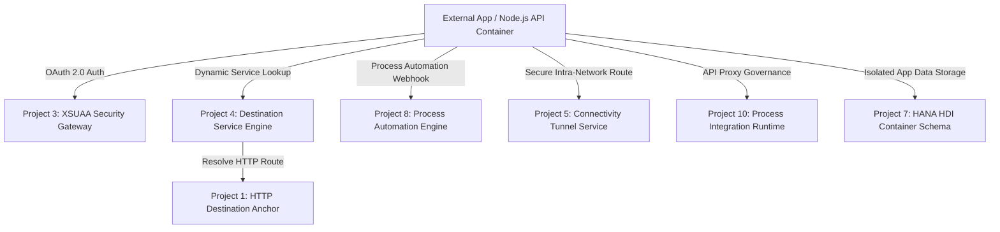

# 🏢 SAP Enterprise Integration & BTP Cloud Architecture Portfolio

Welcome to my master technical repository for SAP cloud configurations, hybrid integration engineering, and side-by-side extensibility frameworks. This repository serves as a live, verified portfolio demonstrating end-to-end engineering capabilities within the SAP Business Technology Platform (BTP) ecosystem, emphasizing the **"Keep the Core Clean"** design paradigm.

---

## 🏗️ Master Architectural Overview
This portfolio maps the complete infrastructure lifecycle required to securely extend, authenticate, route, and automate data processes adjacent to core ERP database schemas (such as SAP Business One or SAP S/4HANA) without altering core source code.

---

## 🛠️ Section A: Core Connectivity & Computing Runtimes

### Project 1: SAP BTP Core Cloud Connectivity Gateway
* **Target Platforms:** SAP BTP Destinations, SAP Business One Service Layer API
* **Configuration Asset:** [`SAP_B1_ServiceLayer.json`](./SAP_B1_ServiceLayer.json)
* **Technical Specification:** HTTP Internet Gateway abstracting direct database credentials via injected OData/REST routing tokens. Establishes a stateless connection bridge for transactional modules.

### Project 2: Multi-Tenant Cloud Extension compute Container
* **Target Platforms:** SAP BTP HTML5 Application Repository, Cloud Foundry Compute Layer
* **Configuration Asset:** [`NodeJS_Extension_Auth_Key.json`](./NodeJS_Extension_Auth_Key.json)
* **Technical Specification:** `html5-apps-repo` service under the `app-runtime` execution plan. Creates an isolated environment sandbox to manage backend compute processing.

### Project 3: Enterprise User Authorization & Trust Management (XSUAA)
* **Target Platforms:** SAP BTP Authorization & Trust Management Service
* **Configuration Asset:** [`XSUAA_Auth_Tokens.json`](./XSUAA_Auth_Tokens.json)
* **Technical Specification:** `xsuaa` engine under the `application` plan. Manages identity governance, scopes validation, and secure verification rules across custom business microservices.

### Project 4: Programmatic Destination Resolution Engine
* **Target Platforms:** SAP BTP Destination Service Core
* **Configuration Asset:** [`Destination_Resolution_Key.json`](./Destination_Resolution_Key.json)
* **Technical Specification:** `destination` engine under the `lite` plan. Functions as the runtime "phone book," allowing cloud applications to discover and resolve secure HTTP endpoint properties programmatically.

### Project 5: Secure Corporate Firewall Tunneling Interface
* **Target Platforms:** SAP BTP Connectivity Service, SAP Cloud Connector Interface
* **Configuration Asset:** [`Cloud_Connector_Tunnel_Key.json`](./Cloud_Connector_Tunnel_Key.json)
* **Technical Specification:** `connectivity` platform service under the `lite` tunnel plan. Establishes encrypted virtual conduits through local corporate firewalls to access on-premise hardware resources safely.

---

## 🛠️ Section B: Advanced Application DevOps & Platform Engineering

### Project 6: Multi-Stage Production Compute Runtime Deployment
* **Target Platforms:** Cloud Foundry Spaces Execution Fabric, Node.js Buildpack Runtime
* **Configuration Asset:** [`manifest.yml`](./manifest.yml), [`package.json`](./package.json), [`server.js`](./server.js)
* **Technical Specification:** Provisioned an isolated, dedicated `production` environment space. Successfully engineered and deployed a live Express.js microservice node application utilizing an automated configuration-as-code layout file to isolate IDE metadata files and link runtime services.

### Project 7: SAP HANA Cloud HDI Container Storage Architecture
* **Target Platforms:** SAP HANA Deployment Infrastructure, SAP HANA Cloud Service
* **Configuration Asset:** [`hana-hdi-manifest.json`](./hana-hdi-manifest.json)
* **Technical Specification:** `hana` service under the `hdi-shared` plan. Allocates an isolated, relational database schema context within SAP’s in-memory memory fabric, segregating extension application metrics from core ERP tables.

### Project 8: Low-Code/No-Code Automated Business Workflow Engine
* **Target Platforms:** SAP Build Process Automation Runtime
* **Configuration Asset:** [`process-automation-manifest.json`](./process-automation-manifest.json)
* **Technical Specification:** `sap-build-process-automation` service under the `free` tier. Establishes an asynchronous decision-handling runtime to manage complex multi-module business approvals and automated trigger sequences.

### Project 9: Centralized Portal Launchpad User Experience Frame
* **Target Platforms:** SAP Build Work Zone, standard edition
* **Configuration Asset:** [`work-zone-manifest.json`](./work-zone-manifest.json)
* **Technical Specification:** `sap-build-work-zone` service under the `standard` infrastructure execution plan. Provisions the centralized navigation framework required to bundle side-by-side applications into a single corporate Fiori design grid workspace.

### Project 10: Enterprise API Traffic Governance Gateway
* **Target Platforms:** SAP Process Integration Runtime, SAP Integration Suite Core
* **Configuration Asset:** [`api-management-manifest.json`](./api-management-manifest.json)
* **Technical Specification:** `it-rt` gateway service under the `integration-flow` plan. Configured a secure API firewall executing an OAuth 2.0 Client Credentials flow combined with `ESBMessaging.send` permissions to safely manage, monitor, and choke inbound public traffic tunnels.
